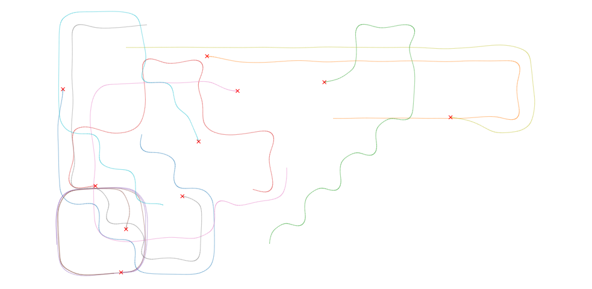

# Duckietown-RL

This repository contains code for our paper: [*Sim-to-real reinforcement learning applied to end-to-end vehicle control*](https://arxiv.org/abs/2012.07461).

|                                                              |                                                              |
| ------------------------------------------------------------ | :----------------------------------------------------------- |
| <a href="https://arxiv.org/abs/2012.07461"></a> | [*Sim-to-real reinforcement learning applied to end-to-end vehicle control*](https://arxiv.org/abs/2012.07461). <br/> András Kalapos, Csaba Gór, Róbert Moni, István Harmati <br/>ISMCR 2020 |

You can find our paper on [IEEE Explore](https://ieeexplore.ieee.org/document/9263751) and on [arXiv.org (https://arxiv.org/abs/2012.07461)](https://arxiv.org/abs/2012.07461).

Please use this bibtex if you would like to cite our work in your publications:


```
@INPROCEEDINGS{Kalapos2020,
  author={András Kalapos and Csaba Gór and Róbert Moni and István Harmati},
  booktitle={2020 23rd International Symposium on Measurement and Control in Robotics (ISMCR)}, 
  title={Sim-to-real reinforcement learning applied to end-to-end vehicle control}, 
  year={2020},
  pages={1-6}}
```

## Video demonstrating the behavior of our agent

|                            |   |
| ------------------------------------------------ | ----------------------- |
| Closed loop control from the robot's perspective | Trajectory of the robot |

The video and the trajectory visualization were recorded at the 5th AI Driving Olympics by the  [Duckietown project](https://www.duckietown.org).

## Setup

To run any demonstration or training code included in this repository, Gym-Duckietown, and other dependencies have to be installed. Three methods are provided for this:
- Using a conda environment
- Downloading one of our pre-built Docker images available on DockerHub (recommended)
- Building the Docker image from this repository

### Setup using conda

*Requirements*: [`git`](https://git-scm.com/) and [`conda`](https://anaconda.org) installed on your computer.

Clone this repository by : 

```bash
git clone https://github.com/kaland313/Duckietown-RL.git
cd Duckietown-RL/
```

The `conda_setup_aido5.sh` shell script creates a new conda environment and installs the required packages in it. Run it by:

```bash conda_setup_aido5.sh```


The script should finish by showing the `Setup successful` message.

Before running any demonstration or training script, the installed conda environment must be activated:

```conda activate dtaido5```

### Using the pre-built Docker image from Docker hub (recommended)

[](https://hub.docker.com/repository/docker/kaland/duckietown-rl/)

[DockerHub: kaland/duckietown-rl](https://hub.docker.com/repository/docker/kaland/duckietown-rl/)

*Requirements*: [`docker`](https://docs.docker.com/get-docker/) or [`nvidia-docker`](https://github.com/NVIDIA/nvidia-docker) installed on your computer.

To download and run the pre-built Docker image, run the following commands:

```
docker pull kaland/duckietown-rl:dtaido5
docker run --rm -dt -p 2233:22 -p 7000:7000 -p 7001:7001 --name dtaido5 kaland/duckietown-rl:dtaido5
```

If your machine has an Nvidia GPU and `nvidia-docker` is set up, replace `docker` with `nvidia-docker` in the previous command.

Now you should be able to ssh into the container by running: 

```ssh -X -A -p 2233 duckie@localhost ```

When you are asked if you trust the authenticity of host type `yes` and when prompted for a password, enter:

```dt2020```

:warning: Don't fortget to change the password for the `duckie` and the `root` users after login!

### Building & runnning the Docker image

*Requirements*: [`docker`](https://docs.docker.com/get-docker/) or [`nvidia-docker`](https://github.com/NVIDIA/nvidia-docker) installed on your computer.

Clone this repository by : 

```
git clone https://github.com/kaland313/Duckietown-RL.git
cd Duckietown-RL/
```

To build and run the Docker image, run the following commands:

```
docker build . --tag dtaido5
docker run --rm -dt -p 2233:22 -p 7000:7000 -p 7001:7001 --name dtaido5 dtaido5
```

If your machine has an Nvidia GPU and `nvidia-docker` is set up, replace `docker` with `nvidia-docker` in the previous command.

You can verify if the container started successfully, by running `docker ps`. You should see something like this:

```
CONTAINER ID  IMAGE       COMMAND  CREATED        STATUS        PORTS   NAMES
be5d600a24c1  dtaido5```  "bash"   7 seconds ago  Up 6 seconds  ...     dtaido5```	
```

Now you should be able to ssh into the container by running: 

```ssh -X -A -p 2233 duckie@localhost ```

When you are asked if you trust the authenticity of host type `yes` and when prompted for a password, enter:

```dt2020```

:warning: Don't fortget to change the password for the `duckie` and the `root` users after login!

### Recommended steps after environment setup

After setting up the conda environment *or* ssh-ing into the docker container, I recommend changing the default log level of Gym-Duckietown to avoid unnecessary logging. Find the installation forlder of Gym-Duckietown (`Duckietown-RL/gym-duckietown` or `/home/duckie/gym-duckietown` in the Docker container).  In `gym-duckietown/src/gym_duckietown/__init__.py` line 8, change `DEBUG` to `WARNING`:  

```
logger.setLevel(logging.DEBUG) -> logger.setLevel(logging.WARNING) 
```

## Train a lane-following policy

Training requires `xfvb`, which is installed in the Docker container. 

Training of a lane-following policy is performed by executing the following command: 

```xvfb-run -a -s "-screen 0 1400x900x24" python -m experiments.train-rllib```

To specify the CPUs and GPUs used for the traingin run: 

```CUDA_VISIBLE_DEVICES=1 xvfb-run -a -s "-screen 0 1400x900x24" taskset --cpu-list 10-19 python -m experiments.train-rllib```

The training can be configured by editing the `experiments/train_rllib.py` script and modifying lines 31-35. For example to train using domain randomisation, these lines should be changed to the following snippet:
```
config_updates = {"seed": 1118,  # Arbitrary unique identifyer of the run
                  "experiment_name": "DomainRandomised",
                  "env_config": {"domain_rand": True,
                                 "dynamics_rand": True,
                                 "camera_rand": True},
                  "rllib_config": {},
                  "timesteps_total": 2.e+6,
                  }
```


For all possible configuration options see `config/config.yml` and `config/algo/ppo.yml`. 

Note that, even on powerful hardware, a training could run for several hours. To see the log of many variables during the training it's recommended to create a Weigths and Biases account and log in when prompted. It's also recommended to run the training in a `screen` or `tmux` session, the first one is installed in the Docker container. 


## Test a lane-following policy in closed loop simulation

To test the lane-following agent in closed loop simulation run:

```python -m experiments.test-rllib```

The simulator window should appear, and the robot should start moving immediately, and follow the right side lane.  

The same simulation can be viewed from a fixed, bird's eye perspective, instead of through the robot's camera. To run in this mode, add the `--top-view` flag to the test command.

``` python -m experiments.test-rllib --top-view```

Default mode               |  Top view
:-------------------------:|:-------------------------:
 | 


## Evaluate closed loop performance and visualize trajectories
The performance of the trained agent is evaluated by calculating some metrics on it closed loop performance. This can be performed by running the command below. 

``` python -m experiments.test-rllib --analyse-trajectories --results-path EvaluationResults```

Metrics for each episode are printed to the standard output, also median and mean values are displayed after all episodes finished. Trajectory plots and the evaluated metrics are saved to a new `EvaluationResults` folder. 


## Visualize salient object maps
Salient object visualization of the trained policy can be performed in the simulation by running the following command. The policy is evaluated in closed loop simulation, while the salient objects are visualized on every frame. 

``` python -m experiments.test-rllib --visualize-salient-obj ```

Salient objects can be visualized on recorded videos (for example, from a real duckiebot) as well:.

```python -m experiments.visualize_salient_maps_video ```

Simulated               |  Real
:-------------------------:|:-------------------------:
 |  

## Multi-episode trajectory visualization

The trajectory of several episodes on multiple maps can be visualized by running the command below. 

```python -m experiments.test-rllib --visualize-dot-trajectories```



The crosses indicate the starting point of the trajectories. 


This version of the shows the same trajectories, but the starting points have been moved to the same road tile, which is represented by the rectangle. This figure is useful for debugging agents that can only travel a few tiles.

## Manual control

You can try to control a duckiebot in the Duckietown simulator using the arrow keys on your keyboard, by running:

``` python -m experiments.manual_control```

Some command line arguments are available to modify the behavior of the simulation:

```
--distortion          Simulate lens distortion
--domain-rand         Enable domain randomization
--top-view       	  View the simulation from a fixed bird's eye view, instead of the robot's view
--spawn-vehicle-ahead Generate an obstacle vehicle a few tiles ahead of the controlled one
--show-observations   Show the cropped, downscaled observations, used as the policy input
--draw-curve          Draw the lane following curve
--map-name MAP_NAME   Specify the map
```


## "Human" baseline

Record and evaluate how a human can control a simulated Duckiebot. 

``` python -m experiments.human_baseline```

In many reinforcement learning problems (e.g. the Atari 2600 games) the agents are compared to human baselines. Motivated by this benchmark we propose a method to measure how well humans are able to control duckiebots, which could be used as a baseline. By running the command above, anyone can measure this "baseline". 

## Classical control theory baseline

Measure how well a hand-tuned PID controller can control a Duckiebot. The controller relies on position and orientation error extracted from the simulation.

``` python -m experiments.pid_baseline```

## Recommended computer specs

- Operating system: Linux, tested on Ubuntu 18.04
- For running demonstrations on a trained model: 8 GB RAM is recommended (not tested with less)
- For training: a powerful GPU and 32 GB RAM is recommended (tested on a machine with an NVidia V100 GPU and 256GB RAM) 

## Removing the installed conda environment or docker image

### Conda environment

To remove the installed conda environment from your system run:

```conda remove --name dtaido5 --all -y```

### Docker image

To stop and remove the container from your system run

```docker stop dtaido5```

## Copyright

The hardware used in our experiments and parts of the software was developed by the [Duckietown project](https://www.duckietown.org). Software components in this repository may partially be copied or derived from the [Duckietown project's repositories](https://github.com/duckietown). 
