# Maps

## Maps used to train our agents

### Maps designed by us

| 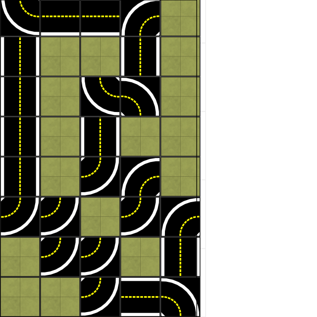 | 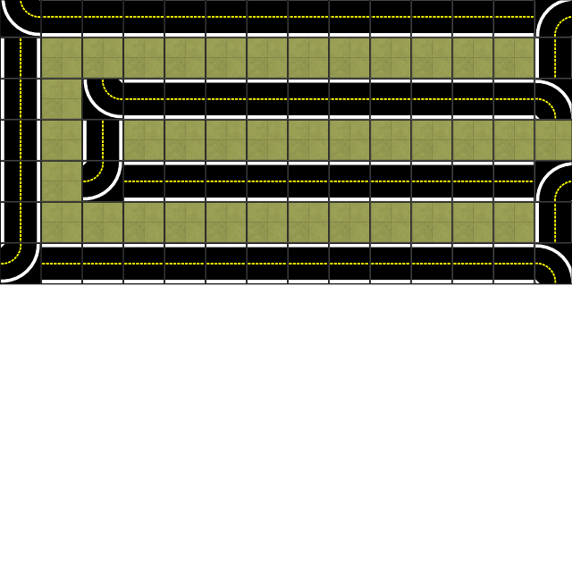 | 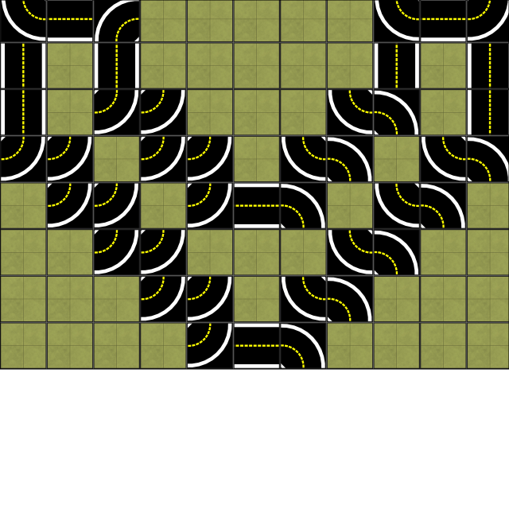 | 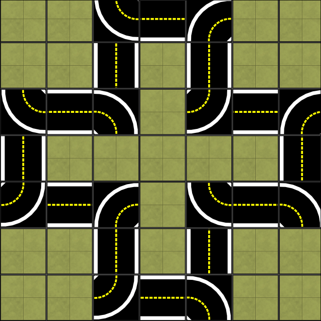 |
| ------------------------------------------------------------ | ------------------------------------------- | ------------------------------------------- | --------------------------------------- |
| _custom_technical_floor                                      | _huge_C_floor                               | _huge_V_floor                               | _plus_floor                             |

### Maps developed by the [Duckietown project](https://www.duckietown.org) 

| 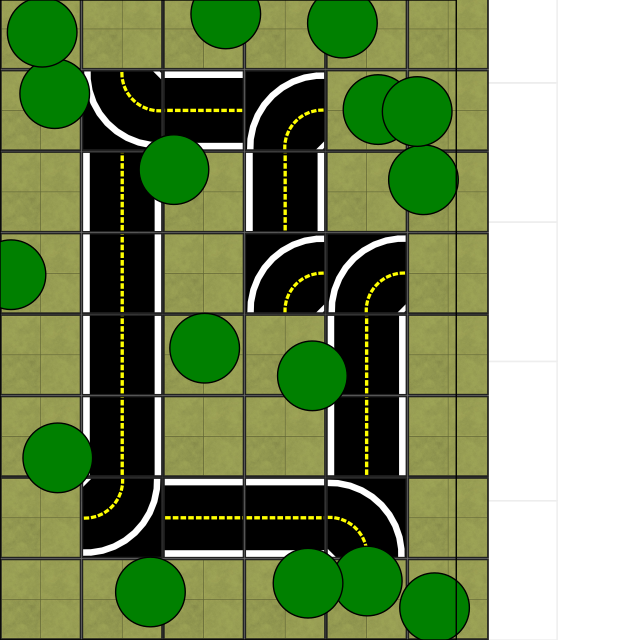           | 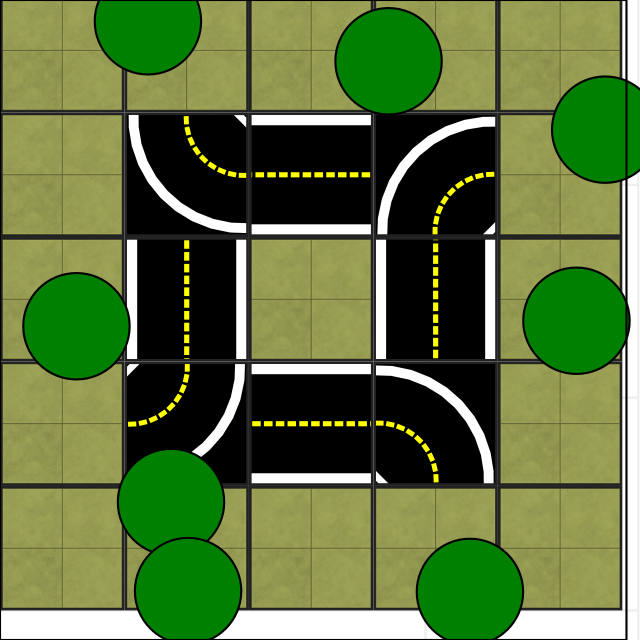 | 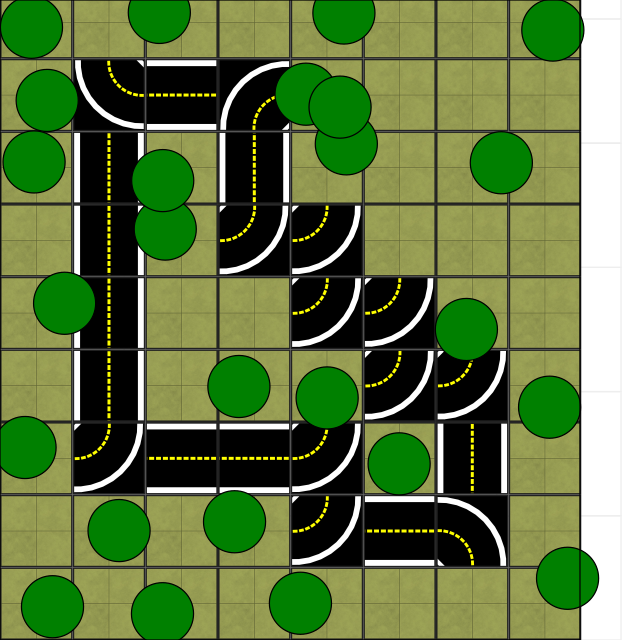 | 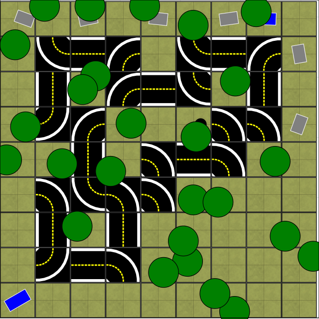 |
| --------------------------------------------------- | ------------------------------------------------------------ | --------------------------------------------------- | --------------------------------------------- |
| LF-norm-loop                                        | LF-norm-small_loop                                           | LF-norm-techtrack                                   | LF-norm-zigzag                                |
| 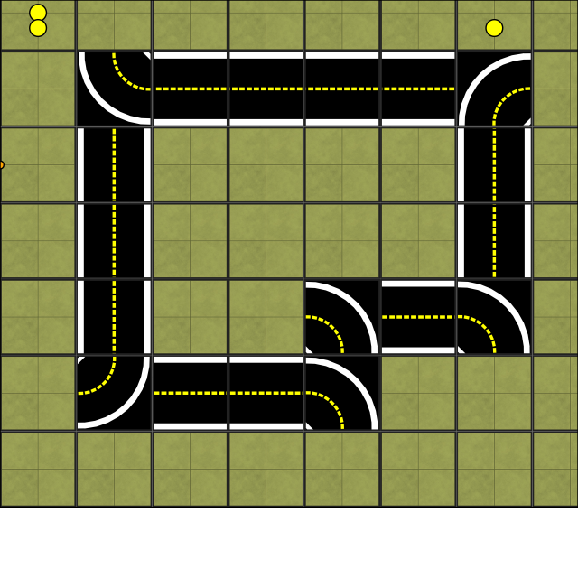 | 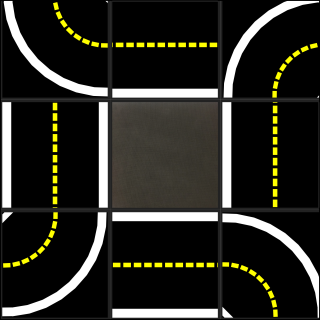                        | 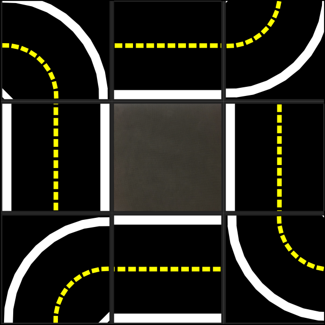         |                                               |
| loop_empty                                          | small_loop                                                   | small_loop_cw                                       |                                               |

## Maps used for testing

| 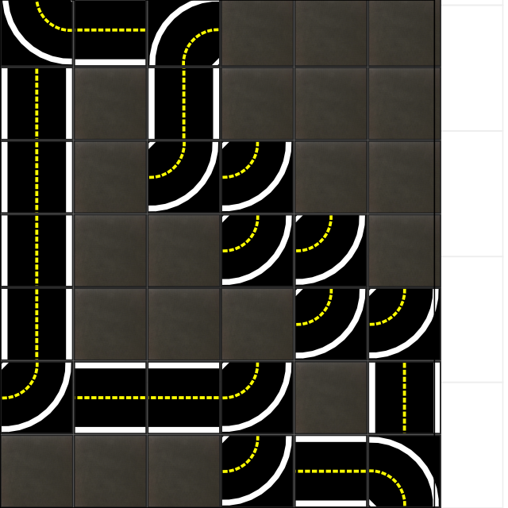 | 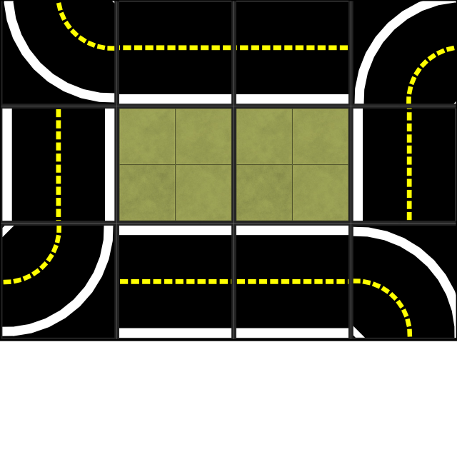 |
| ------------------------------------------------------------ | --------------------------------- |
| ETHZ_autolab_technical_track<br />Developed by the [Duckietown project](https://www.duckietown.org) | _myTestA<br />Designed by us      |


## Generating map visualizations

From the root folder of the repository run: 

```python -m experiments.draw_map```

## Copyright

Some of the maps in this repository were developed by the [Duckietown project](https://www.duckietown.org). Software components in this repository may partially be copied or derived from the [Duckietown project's repositories](https://github.com/duckietown). 